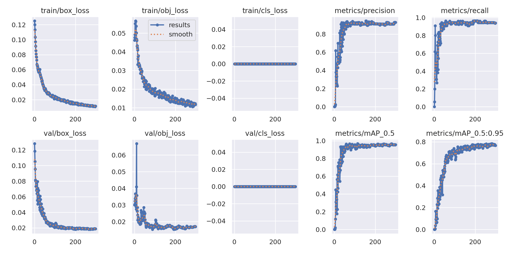
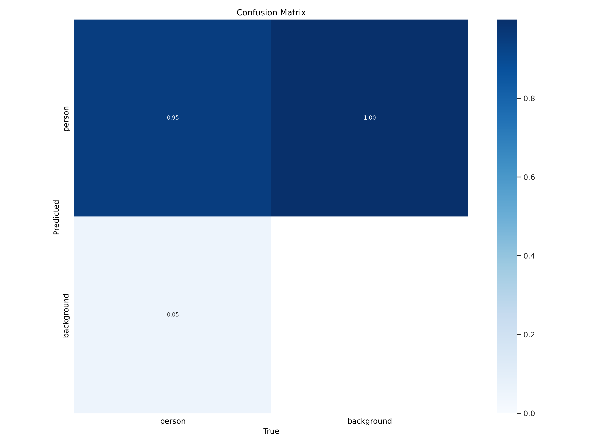
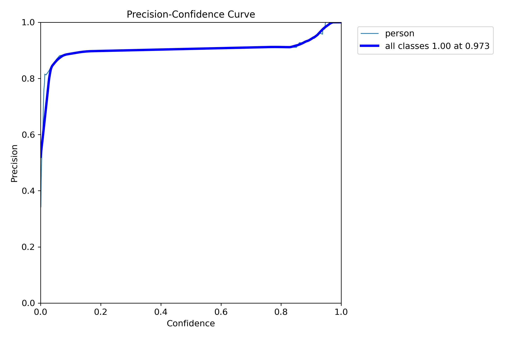
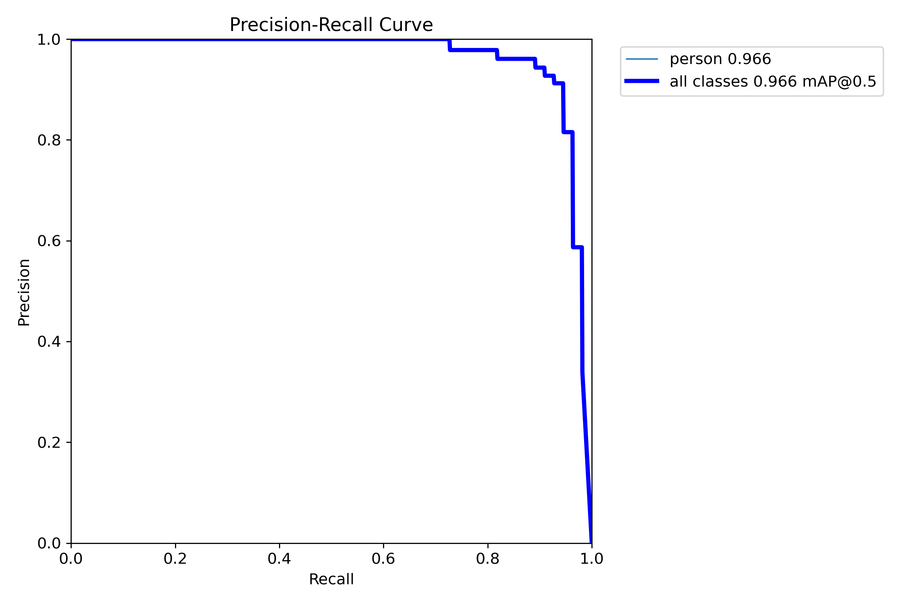
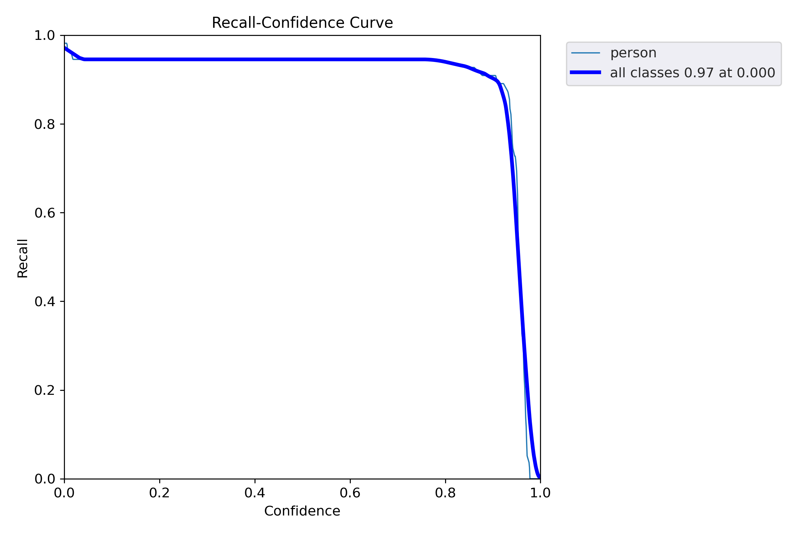

# People Counter in Specific Zone Documentation

## Introduction

The People Counter in Specific Zone project aims to develop a computer vision model capable of detecting and counting people within a predefined region of interest (ROI) in video footage. The project involves several steps, including data collection, labeling, preprocessing, training, validation, testing, and result archiving. The primary tools and technologies used in this project are YOLOv5 for object detection, PyQt5 for image labeling, and Albumentations for image augmentation.

## Project Workflow

### Step 1: Data Collection

The project begins with the collection of video data from a surveillance camera or relevant source. The video data will be used to extract individual frames for labeling and training. The real video is not available for privacy concerns.

### Step 2: Labeling Images

1. Extract Images: Specific frames are extracted from the video at predefined time intervals to create a dataset.

2. Image Labeling: PyQt5 is used to label the saved images. Bounding boxes are drawn around each person within the region of interest (ROI). These boxes are used to define the ground truth for training the object detection model.

3. Save and Archive: Labeled images are saved along with corresponding annotation files. The dataset is divided into training, validation, and testing sets, following best practices for machine learning data splitting.

### Step 3: Preprocessing

1. Define ROI: A region of interest (ROI) is defined within the images. This ROI specifies the area where people are to be detected and counted.

2. Create Mask: A mask is created to isolate the ROI within the images. This ensures that the model focuses on detecting people within the specified area.

3. Image Transformations: The images are preprocessed by converting them to grayscale. This simplifies the model and makes it faster while being insensitive to subject color variations.

4. Image Augmentation: To increase model accuracy and robustness, several image augmentations are applied. These augmentations include:
    - Cutout: Three cutouts of 10% size each are applied to make the model more resilient to object occlusion.
    - Bounding Box Noise: Up to 5% noise per pixel is added to the bounding box region to make the model more resilient to camera artifacts, which is critical for our specific use case.

### Step 4: YOLO Model Fine-Tuning

The YOLOv5 object detection model is re-trained on the preprocessed and augmented dataset. The goal is to teach the model to recognize and count people within the defined region of interest.

### Step 5: Validation and Testing

1. Validation: The newly trained model is validated using a validation dataset to assess its accuracy and performance.

2. Inference: The model is tested by running inference on new images or video footage to further evaluate its effectiveness in detecting and counting people in the specified zone.

### Step 6: Finalizing and Archiving

After successful training and testing, the project is finalized by archiving the results, including the trained model weights, validation results, and any relevant documentation. This ensures that the project outcomes are organized and accessible for future reference and deployment.

## Setting Up the Environment

Follow these steps to set up the Python environment for the People Counter in Specific Zone project:

1. Create a virtual environment named "pc" or "peoplecounter" using the following command:

   ```bash
   python -m venv pc
    ```
2. Activate the virtual environment:
    - On Windows:
        ```bash
        pc\Scripts\activate
        ```
    - On macOS and Linux:
        ```bash
        source pc/bin/activate
        ```

3. Install necessary libraries:
    ```bash
    pip install ipykernel opencv-python numpy
    ```

4. Integrate the environment into the IPython kernel (Jupyter Notebook):
    ```bash
    python -m ipykernel install --user --name=pc
    ```

### Data Preparation

Make sure to include the video inside the directory `data/videos/`.

### Follow Our Guide Walk-Through Notebook

Follow the steps outlined in our guide walk-through notebook to collect, label, preprocess, train, validate, and test your People Counter in Specific Zone project.

## Viewing the Results

The fine-tuned model returned the the following Validation results:
   
|   P   |    R    |  mAP  |
|:-----:|:-------:|:-----:|
| 0.962 |  0.945  | 0.967 |

### Results Graph



### Confusion Matrix



### F1 Curve


### Precision Curve



### Precision-Recall Curve



### Recall-Confidence Curve




## Conclusion

The People Counter in Specific Zone project involves a series of steps, from data collection and labeling to preprocessing, training, and validation. By following this structured workflow and incorporating image augmentations and preprocessing techniques, the goal is to develop an accurate and robust model for counting people
